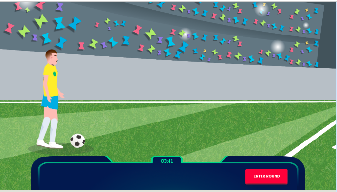

# Challenge Crash

This project creates a game module that can be started in any javascript framework

### [Play demo](https://marcosssantana.github.io/crash-soccer/)

```copy
// Installation
npm i
```

```copy
// To start the project
npm run start
```

```copy
// To generate the build
npm run build
```

|  |  |  |
| ------------------------------ | ------------------------------ | ----------------------------- |
